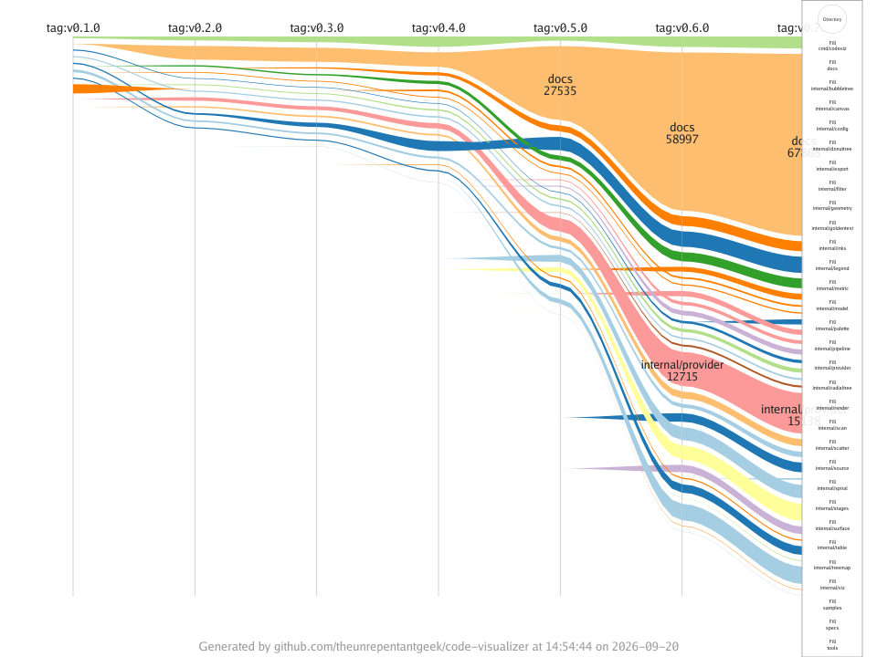

The `alluvial` visualization compares directory metrics across ordered
repository snapshots. Each column is one tag, commit, or date reference, and
the bands trace corresponding repository-relative directories between columns.
It requires a target directory inside a Git repository.



## Synopsis

```text
codeviz alluvial [flags] <target-path>
```

## Required input

`--output` is required. Provide at least two ordered references and a numeric
metric with flags, the configuration file, or both. An empty reference selects
the repository's `HEAD` commit.

| Flag | Short | Values | Description |
| ---- | ----- | ------ | ----------- |
| `--output` | `-o` | `.png`, `.jpg`, `.jpeg`, `.svg` | Output image file path |
| `--reference` | | tag, commit ID, or date (repeatable) | Ordered snapshots; replaces configured references |
| `--metric` | `-m` | numeric metric | Directory metric that determines each flow width |

## Optional flags

| Flag | Default | Description |
| ---- | ------- | ----------- |
| `--expand` | none | Repository-relative directory whose direct children are shown; repeatable |
| `--width` | `1920` | Canvas width in pixels |
| `--height` | `1080` | Canvas height in pixels |
| `--title` | none | Override the title text on the generated image |
| `--footer` | none | Override the footer text on the generated image |
| `--hide-footer` | `false` | Suppress the attribution footer |
| `--include` | none | Include matching files; simple glob (repeatable) |
| `--exclude` | none | Exclude matching files; simple glob (repeatable) |
| `--include-binary-files` | `false` | Include binary files, which are excluded by default |

`--include` and `--exclude` limit the source files that contribute to
directories. They do not control hierarchy detail. Use `--expand` to replace a
directory with its direct children; it never expands recursively or adds an
`Other` aggregate.

## Examples

Compare two release tags using line count for the bands:

```sh
codeviz alluvial . -o releases.svg -m file-lines \
  --reference tag:v1.0 --reference tag:v2.0
```

Show the direct children of `cmd` and `internal` across three snapshots:

```sh
codeviz alluvial . -o milestones.png -m file-lines \
  --reference tag:v1.0 --reference tag:v1.1 --reference tag:v1.2 \
  --expand cmd --expand internal
```

Flow widths are the selected directory metric at each snapshot, not the
difference between adjacent snapshots. A shared scale keeps the same metric
value the same visual width across every column. Directories introduced after
one column or removed before the next taper to or from zero width.

Bands curve between columns and show the directory path and metric value when
there is enough space. The legend maps each path to its band colour when a
band is too narrow for an in-place label.

`--export-data` writes the computed metrics for the first ordered snapshot,
matching the single-snapshot export behavior of other visualizations.

See [Shared concepts]() for metric names
and file-filter rules, and [Configuration]()
for the YAML form.
