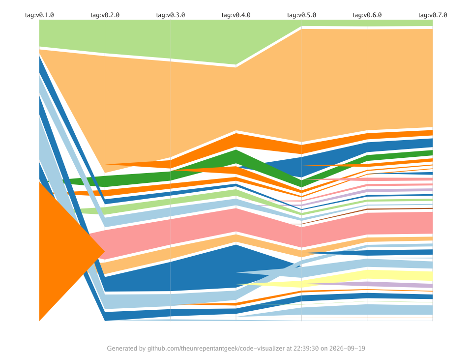

The `alluvial` visualization compares directory metrics across ordered
repository snapshots. Each column is one tag, commit, or date reference, and
the bands trace corresponding repository-relative directories between columns.
It requires a target directory inside a Git repository.



## Synopsis

```text
codeviz alluvial [flags] <target-path>
```

## Required input

`--output` is required. Provide at least two ordered references and a numeric
metric with flags, the configuration file, or both. An empty reference selects
the repository's `HEAD` commit.

| Flag | Short | Values | Description |
| ---- | ----- | ------ | ----------- |
| `--output` | `-o` | `.png`, `.jpg`, `.jpeg`, `.svg` | Output image file path |
| `--reference` | | tag, commit ID, or date (repeatable) | Ordered snapshots; replaces configured references |
| `--metric` | `-m` | numeric metric | Directory metric that determines each flow width |
| `--fill` | `-f` | `metric[,palette]` | Numeric metric and optional palette that determine band colour |

## Optional flags

| Flag | Default | Description |
| ---- | ------- | ----------- |
| `--expand` | none | Repository-relative directory whose direct children are shown; repeatable |
| `--constant-bands` | none | Unchanged bands: `hide`, `mute`, or `merge` |
| `--width` | `1920` | Canvas width in pixels |
| `--height` | `1080` | Canvas height in pixels |
| `--title` | none | Override the title text on the generated image |
| `--footer` | none | Override the footer text on the generated image |
| `--hide-footer` | `false` | Suppress the attribution footer |
| `--include` | none | Include matching files; simple glob (repeatable) |
| `--exclude` | none | Exclude matching files; simple glob (repeatable) |
| `--include-binary-files` | `false` | Include binary files, which are excluded by default |

`--include` and `--exclude` limit the source files that contribute to
directories. They do not control hierarchy detail. Use `--expand` to replace a
directory with its direct children and, when present, a band for files directly
in that directory. Repeat `--expand` for reachable nested directories to reveal
additional levels.

Each snapshot includes a band for files directly in the target directory,
labelled with the target's repository-relative path (`.` for the repository
root), plus bands for the target's child directories. The same partitioning
applies to every expanded directory: child subtrees become bands, and the
expanded directory keeps a band only when it contains files directly. This
means a leaf target still produces one band when it contains files, while an
expanded directory with no direct files does not create an empty remainder
band. A target may be absent or empty at an individual reference, in which case
its bands taper to or from zero; the command fails only when the target contains
no files at every reference.

By default, unchanged bands are displayed normally. A band is constant when
its width metric has exactly the same value at every displayed reference; a
directory introduced or removed during the range is therefore not constant.
Use `--constant-bands hide` to remove constant bands, or `mute` to retain their
geometry in light grey without labels. `merge` also combines each adjacent run
of constant bands in path order into one light-grey, unlabeled band. Changed
bands separate merge runs and keep their normal colours and labels.

## Examples

Compare two release tags using line count for the bands:

```sh
codeviz alluvial . -o releases.svg -m file-lines \
  --reference tag:v1.0 --reference tag:v2.0
```

Show the direct children of `cmd` and `internal` across three snapshots:

```sh
codeviz alluvial . -o milestones.png -m file-lines \
  --reference tag:v1.0 --reference tag:v1.1 --reference tag:v1.2 \
  --expand cmd --expand internal --constant-bands merge
```

Flow widths are the selected directory metric at each snapshot, not the
difference between adjacent snapshots. A shared scale keeps the same metric
value the same visual width across every column, and centers each column
vertically so growth can expand in both directions. Directories introduced
after one column or removed before the next taper to or from zero width.

Bands curve between columns and show the directory path and width metric value
when there is enough space. When `--fill` is specified, labels also show the
fill value used for the colour. By default, their colour uses the width metric value at
the final reference. Select another metric and palette with `--fill`, for
example `--fill commit-count,temperature`. Append `.delta` to the metric to
colour by its change from the first reference to the last, for example
`--fill file-lines.delta,temperature`; zero change uses the palette midpoint.
Append `.stepdelta` to colour each later snapshot by its change from the
immediately preceding snapshot. The first snapshot has no preceding value, so
its fill label is `-` and it is excluded from the numeric palette range.
The legend names the selected fill metric and shows its split values.

`--export-data` writes the computed metrics for the first ordered snapshot,
matching the single-snapshot export behavior of other visualizations.

See [Shared concepts]() for metric names
and file-filter rules, and [Configuration]()
for the YAML form.
