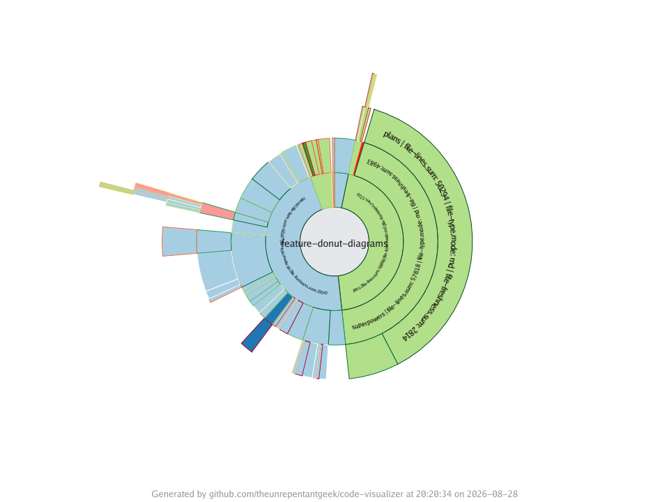

The `donut-tree` visualisation draws the directory hierarchy as nested annular
sectors. Rings represent folder depths and sectors represent directory subtrees,
so it makes it easy to compare the relative size of folders at each level.
Files contribute their metrics to their directories but are never drawn.



## Synopsis

```text
codeviz donut-tree [flags] <target-path>
```

## Required flags

| Flag       | Short | Values                          | Description                         |
| ---------- | ----- | ------------------------------- | ----------------------------------- |
| `--output` | `-o`  | `.png`, `.jpg`, `.jpeg`, `.svg` | Output image file path              |
| `--size`   | `-s`  | see `codeviz help metrics`      | Numeric metric for folder sector size |

## Optional flags

| Flag                   | Short | Default        | Description                                                        |
| ---------------------- | ----- | -------------- | ----------------------------------------------------------------- |
| `--fill`               | `-f`  | `size`         | Folder fill colour: `metric[,palette]`                             |
| `--border`             | `-b`  | no stroke      | Folder border colour: `metric[,palette]`                          |
| `--legend`             |       | `bottom-right` | Legend position, or `none` to hide it                             |
| `--legend-orientation` |       | auto           | Legend orientation: `vertical` or `horizontal`                    |
| `--width`              |       | `1920`         | Image width in pixels                                             |
| `--height`             |       | `1920`         | Image height in pixels                                            |
| `--title`              |       | none           | Override the title text on the generated image                    |
| `--footer`             |       | none           | Override footer text on the generated image                       |
| `--hide-footer`        |       | `false`        | Suppress the attribution footer                                   |
| `--include`            |       | none           | Include matching files; simple glob (repeatable)                  |
| `--exclude`            |       | none           | Exclude matching files; simple glob (repeatable)                  |
| `--include-binary-files` |     | `false`        | Include binary files, which are excluded by default               |

See [Shared concepts]() for the list of metric names,
palettes, and the include and exclude filter rules.

Explicit metrics use the standard directory aggregates. Labels contain the
folder name and effective metrics; they may shrink to 6px or be omitted when
they cannot fit.

## Examples

Size sectors by the total line count of each directory:

```sh
codeviz donut-tree ./src -o donut.png -s file-lines
```

Colour sectors by file type:

```sh
codeviz donut-tree ./src -o donut.png -s file-lines -f file-type,categorization
```

Add borders coloured by file freshness:

```sh
codeviz donut-tree ./src -o donut.png -s file-lines -f file-type,categorization -b file-freshness,good-bad
```
