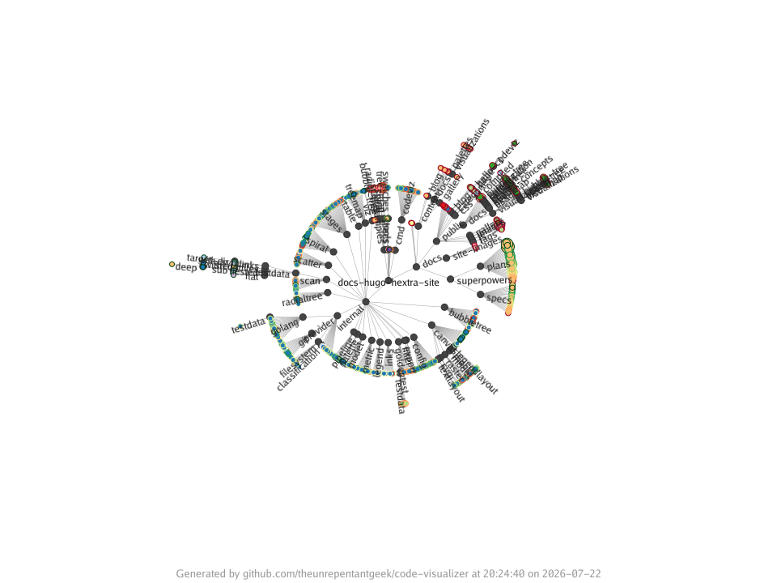

The `radial-tree` visualisation places the repository root at the centre and
fans directories outward as concentric rings, with each file drawn as a disc.
It suits codebases where the depth of the folder hierarchy is itself the story.



## Synopsis

```text
codeviz radial-tree [flags] <target-path>
```

## Required flags

| Flag          | Short | Values                          | Description                  |
| ------------- | ----- | ------------------------------- | ---------------------------- |
| `--output`    | `-o`  | `.png`, `.jpg`, `.jpeg`, `.svg` | Output image file path       |
| `--disc-size` | `-d`  | see `codeviz help metrics`      | Numeric metric for disc size |

## Optional flags

| Flag                   | Short | Default        | Description                                                        |
| ---------------------- | ----- | -------------- | ----------------------------------------------------------------- |
| `--fill`               | `-f`  | none           | Fill colour: `metric[,palette]` (e.g. `file-type,categorization`) |
| `--border`             | `-b`  | none           | Border colour: `metric[,palette]` (e.g. `file-lines,foliage`)     |
| `--labels`             |       | `none`         | Labels to display: `all`, `folders`, or `none`                    |
| `--legend`             |       | `bottom-right` | Legend position, or `none` to hide it                             |
| `--legend-orientation` |       | auto           | Legend orientation: `vertical` or `horizontal`                    |
| `--width`              |       | `1920`         | Image width in pixels                                             |
| `--height`             |       | `1920`         | Image height in pixels                                            |
| `--title`              |       | none           | Override the title text on the generated image                    |
| `--footer`             |       | none           | Override the footer text on the generated image                   |
| `--hide-footer`        |       | `false`        | Suppress the attribution footer                                   |
| `--include`            |       | none           | Include matching files; simple glob (repeatable)                  |
| `--exclude`            |       | none           | Exclude matching files; simple glob (repeatable)                  |
| `--include-binary-files` |     | `false`        | Include binary files, which are excluded by default               |

See [Shared concepts]() for the list of metric names,
palettes, and the include and exclude filter rules.

## Examples

Size discs by file size:

```sh
codeviz radial-tree ./src -o radial.png -d file-size
```

Colour by file type and label the folders:

```sh
codeviz radial-tree ./src -o radial.png -d file-lines -f file-type --labels folders
```
