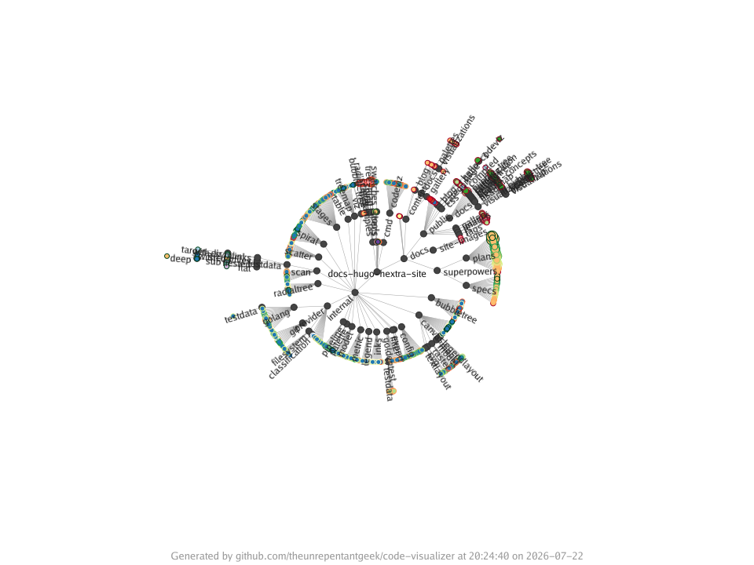

The `radial-tree` visualisation places the repository root at the centre and
fans directories outward as concentric rings, with each file drawn as a disc.
It suits codebases where the depth of the folder hierarchy is itself the story.



## Synopsis

```text
codeviz radial-tree [flags] <target-path>
```

## Required flags

| Flag          | Short | Values                          | Description                  |
| ------------- | ----- | ------------------------------- | ---------------------------- |
| `--output`    | `-o`  | `.png`, `.jpg`, `.jpeg`, `.svg` | Output image file path       |
| `--file-disc-size` | `-d`  | see `codeviz help metrics`      | Numeric metric for file disc size |

## Optional flags

| Flag                   | Short | Default        | Description                                                        |
| ---------------------- | ----- | -------------- | ----------------------------------------------------------------- |
| `--file-fill`          | `-f`  | none           | File fill colour: `metric[,palette]` (e.g. `file-type,categorization`) |
| `--file-border`        | `-b`  | none           | File border colour: `metric[,palette]` (e.g. `file-lines,foliage`) |
| `--folder-disc-size`   |       | none           | Numeric metric for folder disc size                                |
| `--folder-fill`        |       | none           | Folder fill colour: `metric[,palette]` (e.g. `file-type.mode,categorization`) |
| `--folder-border`      |       | none           | Folder border colour: `metric[,palette]` (e.g. `file-freshness.mean,good-bad`) |
| `--labels`             |       | `none`         | Labels to display: `all`, `folders`, or `none`                    |
| `--grain`              |       | `file`         | Granularity of nodes shown: `file` or `directory`                 |
| `--legend`             |       | `bottom-right` | Legend position, or `none` to hide it                             |
| `--legend-orientation` |       | auto           | Legend orientation: `vertical` or `horizontal`                    |
| `--width`              |       | `1920`         | Image width in pixels                                             |
| `--height`             |       | `1920`         | Image height in pixels                                            |
| `--title`              |       | none           | Override the title text on the generated image                    |
| `--footer`             |       | none           | Override the footer text on the generated image                   |
| `--hide-footer`        |       | `false`        | Suppress the attribution footer                                   |
| `--include`            |       | none           | Include matching files; simple glob (repeatable)                  |
| `--exclude`            |       | none           | Exclude matching files; simple glob (repeatable)                  |
| `--include-binary-files` |     | `false`        | Include binary files, which are excluded by default               |

See [Shared concepts]() for the list of metric names,
palettes, and the include and exclude filter rules.

## Examples

Size discs by file size:

```sh
codeviz radial-tree ./src -o radial.png --file-disc-size file-size
```

Colour by file type and label the folders:

```sh
codeviz radial-tree ./src -o radial.png --file-disc-size file-lines --file-fill file-type --labels folders
```

Show the folder structure only, leaving out the files — useful for large codebases:

```sh
codeviz radial-tree ./src -o radial.png --file-disc-size file-lines --grain directory
```

With `--grain directory` every folder is drawn (and named), and no file discs are
drawn. Folder discs are sized and coloured from the aggregated (rolled up)
directory metrics, so the legend describes those rather than the file metrics.
