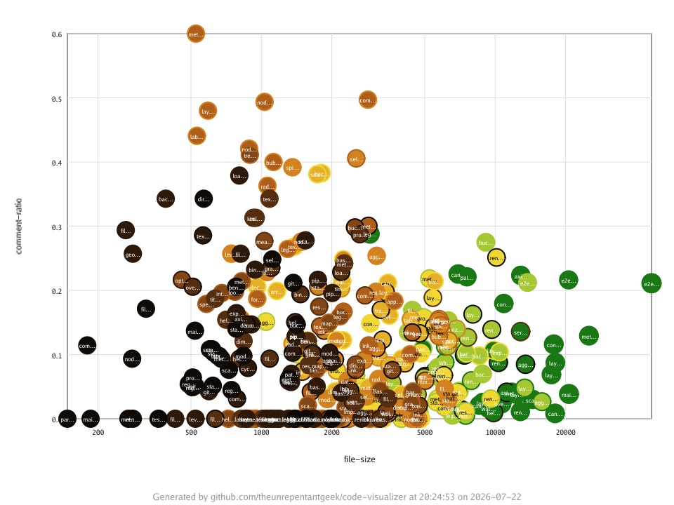

The `scatter` visualisation plots each file as a disc positioned by two metrics —
one on each axis — so you can look for correlations that the tree-based layouts
hide. Plotting file age against commit count, for instance, quickly separates
the stable core from the churning hotspots.



## Synopsis

```text
codeviz scatter [flags] <target-path>
```

## Required flags

| Flag       | Short | Values                          | Description                       |
| ---------- | ----- | ------------------------------- | --------------------------------- |
| `--output` | `-o`  | `.png`, `.jpg`, `.jpeg`, `.svg` | Output image file path            |
| `--x-axis` | `-x`  | see `codeviz help metrics`      | Metric for horizontal position    |
| `--y-axis` | `-y`  | see `codeviz help metrics`      | Metric for vertical position      |
| `--size`   | `-s`  | see `codeviz help metrics`      | Numeric metric for disc size      |

## Optional flags

| Flag                   | Short | Default        | Description                                                        |
| ---------------------- | ----- | -------------- | ----------------------------------------------------------------- |
| `--x-scale`            |       | `linear`       | Horizontal axis scale: `linear` or `log`                          |
| `--y-scale`            |       | `linear`       | Vertical axis scale: `linear` or `log`                            |
| `--fill`               | `-f`  | none           | Fill colour: `metric[,palette]` (e.g. `file-type,categorization`) |
| `--border`             | `-b`  | none           | Border colour: `metric[,palette]` (e.g. `file-lines,foliage`)     |
| `--legend`             |       | `bottom-right` | Legend position, or `none` to hide it                             |
| `--legend-orientation` |       | auto           | Legend orientation: `vertical` or `horizontal`                    |
| `--width`              |       | `1920`         | Image width in pixels                                             |
| `--height`             |       | `1080`         | Image height in pixels                                            |
| `--title`              |       | none           | Override the title text on the generated image                    |
| `--footer`             |       | none           | Override the footer text on the generated image                   |
| `--hide-footer`        |       | `false`        | Suppress the attribution footer                                   |
| `--include`            |       | none           | Include matching files; simple glob (repeatable)                  |
| `--exclude`            |       | none           | Exclude matching files; simple glob (repeatable)                  |
| `--include-binary-files` |     | `false`        | Include binary files, which are excluded by default               |

See [Shared concepts]() for the list of metric names,
palettes, and the include and exclude filter rules.

## Examples

Plot file size against commit count, sizing discs by line count:

```sh
codeviz scatter ./src -o scatter.png -x file-size -y commit-count -s file-lines
```

Compare file age with commit count on a logarithmic horizontal axis, coloured by
file type:

```sh
codeviz scatter ./src -o scatter.png -x file-age -y commit-count -s file-lines -f file-type --x-scale log
```
