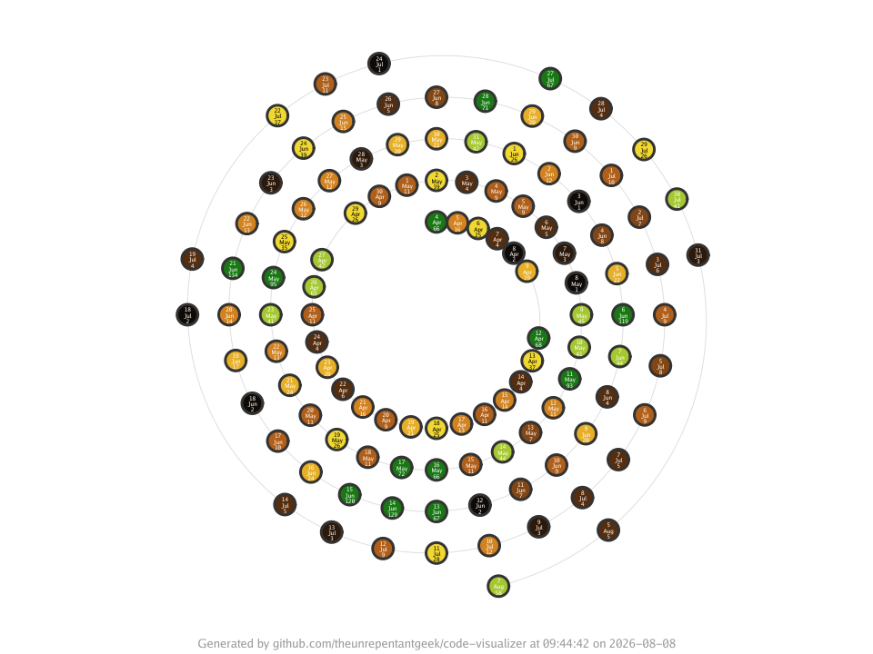

The `spiral` visualisation plots project activity along a spiral of time. Each
lap represents one period — a day or an hour — and every spot is a time bucket
whose discs are sized by an optional metric. It reveals when a codebase was busy
and when it lay dormant, so it requires the target directory to be inside a git
repository.



## Synopsis

```text
codeviz spiral [flags] <target-path>
```

## Required flags

| Flag       | Short | Values                          | Description            |
| ---------- | ----- | ------------------------------- | ---------------------- |
| `--output` | `-o`  | `.png`, `.jpg`, `.jpeg`, `.svg` | Output image file path |

## Optional flags

| Flag                   | Short | Default        | Description                                                        |
| ---------------------- | ----- | -------------- | ----------------------------------------------------------------- |
| `--size`               | `-s`  | none           | Numeric metric for disc size; see `codeviz help metrics`          |
| `--resolution`         | `-r`  | `daily`        | Time resolution: `daily` or `hourly`                              |
| `--fill`               | `-f`  | none           | Fill colour: `metric[,palette]` (e.g. `file-type,categorization`) |
| `--border`             | `-b`  | none           | Border colour: `metric[,palette]` (e.g. `file-lines,foliage`)     |
| `--surface`            |       | `false`        | Render a metric surface; requires numeric fill or surface metric   |
| `--surface-metric`     |       | none           | Numeric surface metric: `metric[,palette]`; enables the surface   |
| `--legend`             |       | `bottom-right` | Legend position, or `none` to hide it                             |
| `--legend-orientation` |       | auto           | Legend orientation: `vertical` or `horizontal`                    |
| `--width`              |       | `1920`         | Canvas width in pixels                                            |
| `--height`             |       | `1920`         | Canvas height in pixels                                           |
| `--title`              |       | none           | Override the title text on the generated image                    |
| `--footer`             |       | none           | Override the footer text on the generated image                   |
| `--hide-footer`        |       | `false`        | Suppress the attribution footer                                   |
| `--include`            |       | none           | Include matching files; simple glob (repeatable)                  |
| `--exclude`            |       | none           | Exclude matching files; simple glob (repeatable)                  |
| `--include-binary-files` |     | `false`        | Include binary files, which are excluded by default               |

See [Shared concepts]() for the list of metric names,
palettes, and the include and exclude filter rules.

## Examples

Plot the daily commit history of a repository:

```sh
codeviz spiral ./src -o spiral.png
```

Switch to an hourly resolution and size discs by line count:

```sh
codeviz spiral ./src -o spiral.png -s file-lines -r hourly
```

## Dot labels and legend

Active dots have upright, centered labels showing their numeric day and
abbreviated month, followed by values for each distinct active size, fill,
border, and surface metric. Spiral labels retain text in SVG, PNG, and JPEG
output, including zero-valued metrics. The circle key in the legend explains
this label structure with `Day`, `Month`, and the configured metric names;
metric names remain listed in the legend entries.

## Metric surfaces

Use `--surface` with a numeric `--fill` metric to add a metric surface beneath
the spiral:

```sh
codeviz spiral ./src -o spiral.png --fill file-lines,terrain --surface
```

The surface is rendered as discrete colour bands in the annular region traced
by the active time buckets. The guide track and discs remain in the foreground.
By default, the surface shares the fill metric and palette, so it does not add
a separate legend entry.

Use `--surface-metric` to select a different numeric metric and optional
palette. It implies surface enablement, so `--surface-metric file-lines,terrain`
does not also need `--surface`. A distinct surface metric adds a `Surface`
entry to the legend:

```sh
codeviz spiral ./src -o spiral.png --fill file-lines,terrain \
  --surface-metric file-size,temperature
```

The same settings can be saved in a configuration file:

```yaml
spiral:
  fill:
    metric: file-lines
    palette: terrain
  surface: true
  surfaceMetric:
    metric: file-size
    palette: temperature
```
