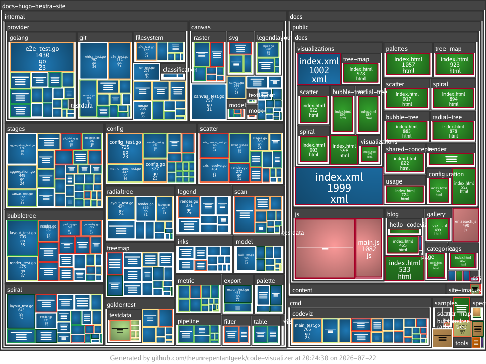

The `tree-map` visualisation packs every file into a rectangle sized by a metric,
nesting directories as enclosing rectangles so the layout mirrors the folder tree.
It is the quickest way to see where the bulk of a codebase lives.



## Synopsis

```text
codeviz tree-map [flags] <target-path>
```

## Required flags

| Flag       | Short | Values                             | Description                    |
| ---------- | ----- | ---------------------------------- | ------------------------------ |
| `--output` | `-o`  | `.png`, `.jpg`, `.jpeg`, `.svg`    | Output image file path         |
| `--size`   | `-s`  | see `codeviz help metrics`         | Numeric metric for cell area   |

## Optional flags

| Flag                   | Short | Default        | Description                                                        |
| ---------------------- | ----- | -------------- | ----------------------------------------------------------------- |
| `--fill`               | `-f`  | none           | Fill colour: `metric[,palette]` (e.g. `file-type,categorization`) |
| `--border`             | `-b`  | none           | Border colour: `metric[,palette]` (e.g. `file-lines,foliage`)     |
| `--legend`             |       | `bottom-right` | Legend position, or `none` to hide it                             |
| `--legend-orientation` |       | auto           | Legend orientation: `vertical` or `horizontal`                    |
| `--width`              |       | `1920`         | Image width in pixels                                             |
| `--height`             |       | `1080`         | Image height in pixels                                            |
| `--title`              |       | none           | Override the title text on the generated image                    |
| `--footer`             |       | none           | Override the footer text on the generated image                   |
| `--hide-footer`        |       | `false`        | Suppress the attribution footer                                   |
| `--flat`               |       | `false`        | Disable pincushion shading and use flat solid fills               |
| `--include`            |       | none           | Include matching files; simple glob (repeatable)                  |
| `--exclude`            |       | none           | Exclude matching files; simple glob (repeatable)                  |
| `--include-binary-files` |     | `false`        | Include binary files, which are excluded by default               |

See [Shared concepts]() for the list of metric names,
palettes, and the include and exclude filter rules.

## Examples

Size cells by file size, with no separate fill metric:

```sh
codeviz tree-map ./src -o treemap.png -s file-size
```

Colour each cell by its file type:

```sh
codeviz tree-map ./src -o treemap.png -s file-size -f file-type
```

Colour by how recently each file changed, using the temperature palette:

```sh
codeviz tree-map ./src -o treemap.png -s file-lines -f file-freshness,temperature
```

Add a border metric to show how many authors have touched each file:

```sh
codeviz tree-map ./src -o treemap.png -s file-lines -f file-freshness -b author-count
```

Render at 4K with verbose logging:

```sh
codeviz -v tree-map ./src -o treemap.png -s file-size --width 3840 --height 2160
```
