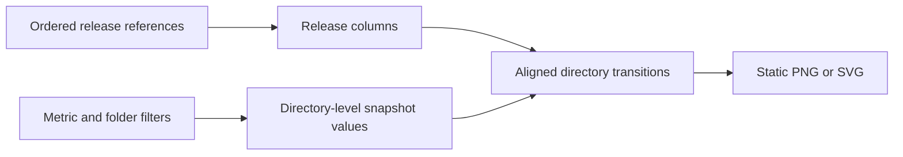
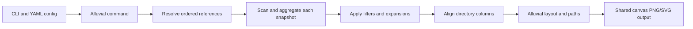

# Alluvial Diagram - Plan

## Goal Capsule

- **Objective:** Let CodeViz users understand how a codebase changes between releases through a static, directory-level visual artifact.
- **Product authority:** This plan defines the Alluvial Diagram's user-visible scope; implementation planning selects the command, configuration, aggregation, and rendering mechanics.
- **Open blocker:** None.

---

## Product Contract

### Summary

Add an Alluvial Diagram visualization that renders a static PNG or SVG showing directory-level change across ordered release references.
It supports a focused two-tag comparison and an optional multi-release evolution view without turning the output into an interactive explorer.

### Problem Frame

Release comparisons need to show how change is distributed through a codebase, including subsystem churn, feature introduction or deprecation, and documentation evolution.
The output should preserve directory identity across releases so readers can understand change in context rather than only as a list of commits or files.

### Key Decisions

- **Static release artifact:** The diagram is generated by CLI parameters and YAML configuration as PNG or SVG, rather than offering image-level interaction. (session-settled: user-directed — chosen over an interactive explorer: CodeViz is a command-line image generator.) Governs R1, R8.
- **Reference inputs:** Tags are the primary release workflow, while the existing broader revision-reference inputs remain valid. (session-settled: user-directed — chosen over tags only: preserve established reference flexibility.) Governs R2.
- **Comparison span:** Two references are the primary comparison, with ordered multi-release sequences available when supplied. (session-settled: user-directed — chosen over separate modes: one visualization supports both scopes.) Governs R1.
- **Metric-driven width:** Flow thickness is configurable instead of fixed to one change measure. It represents the selected metric's value in each release snapshot, rather than the change over the preceding release interval. (session-settled: user-directed — chosen over lines changed, files changed, or net line delta alone: callers select the measure relevant to their investigation.) Governs R5.
- **Filter-led directory scope:** Existing include and exclude filtering limits represented folders; the output neither creates an "Other" dimension nor automatically chooses recursive hierarchy breaks. Governs R6, R7.

### Requirements

**Release comparison**

- R1. Render an Alluvial Diagram from an ordered sequence of at least two revision references, producing a comparable directory-level column for every selected reference.
- R2. Make Git tags the first-class release input while retaining compatibility with the project’s supported revision references.
- R3. Preserve directory identity across selected references so a reader can distinguish ongoing, newly appearing, and disappearing directory-level change.
- R4. Render a newly appearing directory as a flow tapering from zero width at the prior reference to its full width at the introduced reference, and render a disappearing directory as the reverse.

**Metric encoding**

- R5. Let CLI parameters or YAML configuration select the metric whose per-snapshot directory value determines each flow's thickness.

**Directory scope**

- R6. Apply existing include and exclude filtering to determine the folders represented in the diagram.
- R7. Keep hierarchy detail explicit and bounded by user-supplied scope; do not aggregate omitted folders into an "Other" dimension or automatically recurse into the largest directories.

**Output**

- R8. Generate the diagram through the project’s standard static-image output path in PNG and SVG formats.

### Key Flow

- F1. Generate a release-change diagram
  - **Trigger:** A user invokes the Alluvial Diagram with ordered release references, a metric, and optional folder filters.
  - **Steps:** Resolve each reference; derive the selected directory-level snapshot metric values; align directory identities across release columns; render their transitions into the requested static-image format.
  - **Outcome:** The resulting image shows the selected release evolution at a readable directory scope.
  - **Covers:** R1, R2, R3, R4, R5, R6, R7, R8.

### Acceptance Examples

- AE1. **Covers R1, R2, R8.** Given two release tags, when the user requests an Alluvial Diagram, then CodeViz produces a PNG or SVG with one comparable directory-level column per tag.
- AE2. **Covers R1, R3, R4.** Given more than two ordered release references, when the user requests the diagram, then the image shows the same selected directories across the full sequence, with new directories tapering in from zero width and removed directories tapering out to zero width.
- AE3. **Covers R5.** Given a selected metric, when the diagram is rendered, then each release column's flow thickness reflects its snapshot value rather than a hard-coded measure.
- AE4. **Covers R6, R7.** Given include or exclude filters that narrow the source tree, when the diagram is rendered, then only the resulting folders are represented, with no synthetic "Other" dimension or automatic hierarchy expansion.

### Scope Boundaries

- The v1 output is a generated static image, not an interactive drill-down or navigation surface.
- Automatic recursive expansion based on change volume is deferred.
- The diagram does not substitute an aggregate "Other" dimension for omitted folders.
- Hierarchy detail uses explicit direct-child expansion; it does not reinterpret include patterns.

### Dependencies / Assumptions

- Existing revision-range handling, historical snapshots, and static PNG/SVG rendering remain available to the new visualization.
- Existing visualization pipelines compose shared acquisition, aggregation, layout, and canvas-writing stages that the implementation can reuse where applicable.
- Directory-level snapshot metric values can be derived consistently for every selected revision reference.

### Sources / Research

- `cmd/codeviz/treemap_cmd.go` and `cmd/codeviz/render_cmd.go` establish existing revision-reference and changed-only command conventions.
- `internal/stages/source.go` resolves live or historical filesystem snapshots for visualizations.
- `internal/treemap/pipeline.go` and `internal/spiral/pipeline.go` demonstrate reusable visualization pipelines built from shared stages.
- `internal/stages/aggregation.go` computes metric values for each directory from its descendant content.
- `internal/canvas/format.go` establishes PNG and SVG output support.
- `docs/content/docs/usage.md` documents revision-range and snapshot behavior.
- `docs/superpowers/specs/2026-09-05-git-tag-constraints-design.md` records lower-exclusive and upper-inclusive tag-range semantics.

---

## Planning Contract

### Product Contract Preservation

Product Contract unchanged.

### Key Technical Decisions

- KTD1. **Dedicated hierarchy expansion:** Add repeatable `--expand` and matching YAML configuration for direct-child directory detail; keep `--include` and `--exclude` as their current file-scope filters. This resolves the deferred configuration question without overloading glob semantics. Governs R6, R7.
- KTD2. **Snapshot-per-reference model:** Resolve and scan each ordered reference independently, then align selected directory paths between adjacent columns. Each column's flow widths encode the selected metric's value in that reference's snapshot; they do not encode an adjacent-reference delta. This preserves static historical snapshots and supports both two-reference and multi-reference views. Governs R1, R2, R3, R4, R5.
- KTD3. **Reference-list input:** Expose a repeatable `--reference` value and an ordered YAML `references` list. Each value accepts the project's existing revision-reference syntax, including tags; command-line references replace the configured list as one ordered source of truth. Preserve caller order without rejecting references for chronology or ancestry. Governs R1, R2.
- KTD4. **Native canvas flows:** Render tapered transitions as filled paths through the existing canvas abstraction so PNG and SVG share the same geometry. Governs R4, R8.

### High-Level Technical Design

### Assumptions

- A selected metric can be resolved and aggregated for each historical snapshot using the existing provider and aggregation infrastructure.
- Directory identity is the repository-relative directory path after filters and explicit expansions are applied.

---

## Implementation Units

### U1. Define alluvial command and configuration

- **Goal:** Expose the alluvial visualization, ordered references, metric selection, and explicit directory expansion through the established CLI/YAML conventions.
- **Requirements:** R1, R2, R5, R6, R7, R8.
- **Dependencies:** None.
- **Files:** `cmd/codeviz/main.go`, `cmd/codeviz/alluvial_cmd.go`, `cmd/codeviz/alluvial_cmd_test.go`, `internal/config/config.go`, `internal/config/alluvial.go`, `internal/config/config_test.go`.
- **Approach:** Mirror an existing visualization command’s config merge, overrides, filter mapping, and validation; add the alluvial config section to export handling; define repeatable `--reference` and ordered YAML `references` inputs whose CLI values replace configured values; define `--expand` as repeatable direct-child expansion while preserving existing include/exclude behavior.
- **Patterns to follow:** `cmd/codeviz/treemap_cmd.go`, `cmd/codeviz/filteradapter.go`, `internal/config/treemap.go`.
- **Test scenarios:** Validate required output and at least two ordered references; accept tags and the established revision-reference syntax; reject invalid metrics and invalid expansion paths; confirm CLI references replace the YAML reference list while repeated include/exclude and expand inputs retain order.
- **Verification:** Command parsing and configuration tests prove the public contract before rendering work begins.

### U2. Build reference snapshots and directory transitions

- **Goal:** Produce aligned directory-level values for every selected reference and identify continuing, introduced, and removed directories.
- **Requirements:** R1, R2, R3, R4, R5, R6, R7.
- **Dependencies:** U1.
- **Files:** `internal/alluvial/state.go`, `internal/alluvial/data.go`, `internal/alluvial/data_test.go`, `internal/alluvial/pipeline.go`, `internal/stages/source.go`.
- **Approach:** Reuse source resolution, filtering, provider execution, and directory aggregation for each reference; use each reference's own snapshot metric values for its column; retain directory paths as alignment keys; create zero-width endpoint values for paths absent on one side of a transition.
- **Execution note:** Establish synthetic multi-reference fixtures before implementing geometry so additions, removals, filtering, and expansion semantics are characterized independently.
- **Patterns to follow:** `internal/spiral/pipeline.go`, `internal/stages/aggregation.go`, `internal/stages/source.go`.
- **Test scenarios:** Covers AE2 and AE3. Align unchanged directories across three references using their independent snapshot values; create introduced and removed transition records; exclude filtered directories; expand only selected directories into direct children; report unresolved or malformed references clearly while preserving caller order.
- **Verification:** Data tests prove a stable, deterministic transition model without requiring image assertions.

### U3. Lay out and render alluvial flows

- **Goal:** Turn aligned transitions into readable columns and tapered filled paths on the shared canvas.
- **Requirements:** R3, R4, R5, R8.
- **Dependencies:** U2.
- **Files:** `internal/alluvial/layout.go`, `internal/alluvial/layout_test.go`, `internal/alluvial/render.go`, `internal/alluvial/render_test.go`, `internal/alluvial/pipeline.go`.
- **Approach:** Allocate each reference column from aggregated metric values, build continuous paths for present directories, and taper from or to zero at introduction and removal boundaries; use canvas filled paths and existing ink/palette resolution.
- **Patterns to follow:** `internal/canvas/filled_path.go`, `internal/canvas/canvas.go`, `internal/treemap/render.go`.
- **Test scenarios:** Covers AE2 and AE3. Render continuing flows with metric-proportional widths; taper additions and removals in the correct direction; handle zero/empty metric values without invalid geometry; preserve readable ordering when several directories share a column.
- **Verification:** Layout tests assert geometry invariants and render tests assert the canvas receives valid shapes.

### U4. Integrate output coverage and documentation

- **Goal:** Prove the complete command produces stable PNG/SVG output and document its reference, filtering, metric, and expansion semantics.
- **Requirements:** R1, R2, R5, R6, R7, R8.
- **Dependencies:** U1, U2, U3.
- **Files:** `cmd/codeviz/alluvial_cmd_test.go`, `internal/goldentest/viz_golden_test.go`, `internal/goldentest/testdata/`, `docs/content/docs/usage.md`, `docs/content/docs/configuration.md`.
- **Approach:** Add a Git-fixture command/source integration test proving tag resolution, focused command coverage, and PNG/SVG goldens using deterministic synthetic history; document tag-led usage, broader revision compatibility, snapshot metric semantics, filters, and `--expand`.
- **Patterns to follow:** `internal/goldentest/viz_golden_test.go`, `docs/content/docs/usage.md`.
- **Test scenarios:** Covers AE1 and AE4. Resolve a two-tag Git fixture through the command/source path; render a two-tag PNG/SVG pair; render a multi-reference sequence; verify filtered and explicitly expanded output; preserve deterministic output with pinned metadata.
- **Verification:** Golden comparisons and documentation examples demonstrate the same static behavior in both supported formats.

---

## Verification Contract

- Run focused command, config, data, layout, render, and golden tests for the alluvial packages and command.
- Run `task test` for regression coverage and `task lint` for repository linting after implementation.
- Inspect both PNG and SVG goldens for column ordering, tapered additions/removals, and filter/expansion effects.

---

## Definition of Done

- U1-U4 are complete with the cited requirements and acceptance examples covered.
- The command generates matching semantic output in PNG and SVG for two and multiple references.
- Directory filters and explicit expansions bound visible dimensions without an "Other" aggregate or automatic expansion.
- Added and removed directories taper correctly at their release boundary.
- Tests, linting, and golden artifacts pass; abandoned experimental rendering paths are removed.