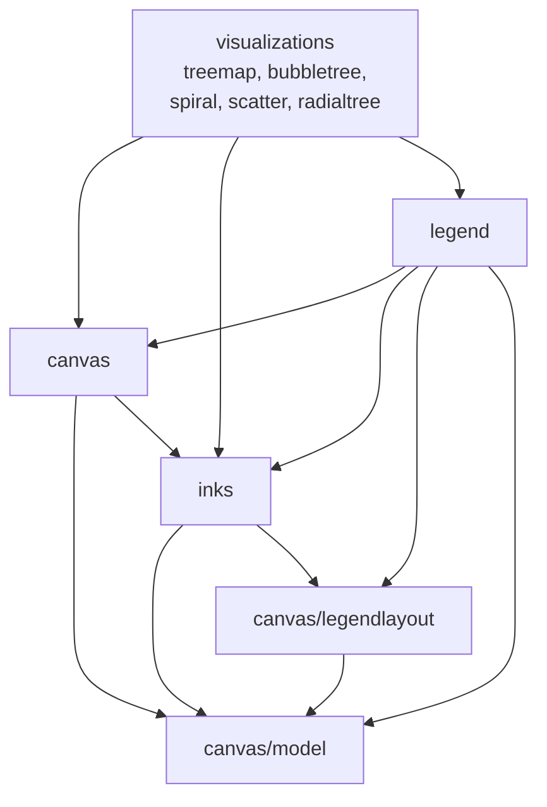

# Restoring Ink Encapsulation in the `inks` Package

**Status:** Design approved, awaiting implementation plan.
**Date:** 2026-06-20.

## Problem

The repository has an `internal/inks` package, but the `Ink` interface and every
concrete `Ink` implementation live in `internal/canvas`. Today `internal/inks`
holds only four helper functions; the package imports `canvas` to access the
types it nominally owns. The dependency direction is backwards from the
package's name, and `canvas` carries machinery (colour resolution, metric value
shaping, legend semantics) that has nothing to do with retained-mode drawing.

## Goal

Move ink-related infrastructure out of `internal/canvas` so that:

- `internal/inks` owns the `Ink` interface and all concrete implementations,
  along with the `MetricValue` shape they consume.
- `internal/legend` owns legend authoring **and** rendering (it already owns
  authoring); `canvas` stops carrying any legend-specific code.
- `internal/canvas` becomes a pure retained-mode drawing surface that holds
  `inks.Ink` values inside its shape specs but knows nothing about how those
  inks resolve to colours, nor how legends are laid out.

No behavioural change. No new features. No visualisation output should differ
byte-for-byte; golden snapshots remain unchanged.

## Scope

In scope:

1. Move the `Ink` interface, `baseInk`, the factory functions
   (`FixedInk`, `NumericInk`, `CategoricalInk`), the `RadialGradientInk`
   decorator, the option mechanism (`InkOption` / `WithOpacity`), the
   introspection types and accessors (`InkInfo`, `InkKind`, `Boundaries`,
   `Palette`, `Categories`), and the `MetricValue` family from `internal/canvas`
   into `internal/inks`.
2. Move `LegendConfig`, `LegendEntry`, `LegendRole`, `DefaultOrientation`, the
   private legend-rendering machinery (`legendBuilder`, `decomposeLegend`,
   `legendOrigin`, the `addEntries*` / `addSwatch` / `addLabelSample` helpers),
   and the `toLegendData` conversion from `internal/canvas` into
   `internal/legend`. Replace `(*Canvas).SetLegend` with a public
   `legend.RenderInto(c *canvas.Canvas, cfg *legend.Config)` entry point.
3. Add public `DrawingMinY() int` / `DrawingMaxY() int` getters on
   `*canvas.Canvas` so that `legend.RenderInto` can place top-center and
   bottom-center legends respecting title and footer reservations.
4. Drop stutter from the moved type names (e.g. `inks.Kind` rather than
   `inks.InkKind`, `legend.Config` rather than `legend.LegendConfig`).
5. Update every call site in the visualization packages (`treemap`,
   `bubbletree`, `spiral`, `scatter`, `radialtree`), `internal/legend`, and
   `cmd/codeviz` to use the new package locations and names.

Out of scope:

- Renaming or relocating `internal/canvas/legendlayout` or
  `internal/canvas/model`. Both end up consumed by `canvas`, `inks`, and
  `legend` but their location is not part of the encapsulation goal. A future
  spec may revisit.
- Moving `TextColourFor`. It picks black-or-white text for contrast against a
  resolved fill colour; it neither depends on nor is depended on by `Ink`. It
  stays in `canvas`.
- Any change to the `Backend` interface, raster / SVG backends, or
  `textlayout` package.
- Any change to the ink construction helpers `BuildMetricInk`,
  `MetricValueForFile`, `CollectNumericValues`, `CollectDistinctTypes`. They
  remain in `internal/inks/inks.go`; after the move they simply stop importing
  `canvas`.

## Architecture After the Move



No cycles. `canvas/model` and `canvas/legendlayout` remain physically located
under `canvas/` but functionally serve all three of `canvas`, `inks`, and
`legend` as leaf dependencies.

### Package responsibilities

**`internal/inks`** — colour-resolution machinery
- `Ink` interface: `Dip(MetricValue) color.RGBA`, `Fill(MetricValue, model.Point) model.Fill`, `Info() Info`.
  The interface also exposes introspection methods promoted from `*baseInk`
  today: `Boundaries() []float64`, `Palette() palette.ColourPalette`,
  `Categories() []string`. `RadialGradientInk` forwards each of these to its
  inner ink, just as it already forwards `Info()`.
- `baseInk` struct plus factories `FixedInk`, `NumericInk`, `CategoricalInk`.
- `RadialGradientInk` and `NewRadialGradientInk`.
- `Option` (was `InkOption`) and `WithOpacity`.
- `Info` (was `InkInfo`), `Kind` (was `InkKind`), constants `KindFixed`,
  `KindNumeric`, `KindCategorical` (were `InkFixed`/`InkNumeric`/`InkCategorical`).
- `MetricValue`, `MeasureValue`, `QuantityValue`, `CategoryValue`.
- `LegendData(Ink) (model.LegendEntryKind, []model.LegendSwatch)` — a free
  function that branches on `ink.Info().Kind` and uses the introspection
  accessors to extract swatch data. This replaces the unexported
  `legendEntryKind()` / `legendSwatches()` methods on `*baseInk` and
  `*RadialGradientInk`. Returning canvas-model types is a deliberate
  pragmatic choice; the alternative of defining neutral `inks.Swatch`
  types and translating in `legend` adds a layer with no concrete benefit.
- Existing helpers (`BuildMetricInk`, `MetricValueForFile`,
  `CollectNumericValues`, `CollectDistinctTypes`) stay in
  `internal/inks/inks.go`. They no longer import `canvas`.

**`internal/legend`** — legend authoring and rendering
- Already owns `ResolveOptions`, `Build`, `ReserveSpace` (in `reserve.go`).
- Gains the configuration types: `Config` (was `canvas.LegendConfig`), `Entry`
  (was `canvas.LegendEntry`), `Role` and `RoleFill` / `RoleBorder` /
  `RoleSize` (were `canvas.LegendRole*`).
- Gains `DefaultOrientation` (was `canvas.DefaultOrientation`).
- Gains the rendering machinery (`legendBuilder` and helpers, `legendOrigin`,
  conversion to `model.LegendData`).
- New public entry point:

```go
// RenderInto places the legend's overlay shapes onto cv at LayerOverlay.
// Does nothing when cfg is nil, has no entries, or is positioned None.
func RenderInto(cv *canvas.Canvas, cfg *Config)
```

  Visualizations call this between the last data-shape addition and
  `cv.Render(path)`.

**`internal/canvas`** — pure retained-mode drawing surface
- Keeps: `Canvas`, `Backend`, `Layer` constants, primitives (`Rectangle`,
  `Disc`, `Text`, `Line`, `Path`, `ArcText`), specs (`ShapeStyle`,
  `RectangleSpec`, `DiscSpec`, `LineSpec`, `TextSpec`, `ArcTextSpec`),
  `TextColourFor`, title/footer support, format detection, geometry, the
  `raster`/`svg` backends, and `textlayout`.
- Loses: every ink type, every legend type, `decomposeLegend` and its helpers,
  the `c.legend` field, `SetLegend`, and the `if c.legend != nil` branch in
  `RenderTo`.
- Gains two getters:

```go
func (c *Canvas) DrawingMinY() int { return c.drawingMinY }
func (c *Canvas) DrawingMaxY() int { return c.drawingMaxY }
```

- Spec fields continue to hold `Ink`, but the type now resolves to `inks.Ink`
  via an import. The `canvas` package imports `inks`.

## Public API Mapping

### canvas → inks

| Before | After |
|---|---|
| `canvas.Ink` | `inks.Ink` |
| `canvas.FixedInk` | `inks.FixedInk` |
| `canvas.NumericInk` | `inks.NumericInk` |
| `canvas.CategoricalInk` | `inks.CategoricalInk` |
| `canvas.NewRadialGradientInk` | `inks.NewRadialGradientInk` |
| `canvas.RadialGradientInk` | `inks.RadialGradientInk` |
| `canvas.InkOption` | `inks.Option` |
| `canvas.WithOpacity` | `inks.WithOpacity` |
| `canvas.InkInfo` | `inks.Info` |
| `canvas.InkKind` | `inks.Kind` |
| `canvas.InkFixed` | `inks.KindFixed` |
| `canvas.InkNumeric` | `inks.KindNumeric` |
| `canvas.InkCategorical` | `inks.KindCategorical` |
| `canvas.MetricValue` | `inks.MetricValue` |
| `canvas.MeasureValue` | `inks.MeasureValue` |
| `canvas.QuantityValue` | `inks.QuantityValue` |
| `canvas.CategoryValue` | `inks.CategoryValue` |

### canvas → legend

| Before | After |
|---|---|
| `canvas.LegendConfig` | `legend.Config` |
| `canvas.LegendEntry` | `legend.Entry` |
| `canvas.LegendRole` | `legend.Role` |
| `canvas.LegendRoleFill` | `legend.RoleFill` |
| `canvas.LegendRoleBorder` | `legend.RoleBorder` |
| `canvas.LegendRoleSize` | `legend.RoleSize` |
| `canvas.DefaultOrientation(pos)` | `legend.DefaultOrientation(pos)` |
| `(*canvas.LegendConfig).ReserveSpace()` | `(*legend.Config).ReserveSpace()` *(method preserved; thin delegate to `legendlayout.ReserveSpace`)* |
| `(*canvas.Canvas).SetLegend(LegendConfig)` | **Removed.** Use `legend.RenderInto(cv, cfg)` after data shapes are added. |

### Factory names retain `Ink`

`FixedInk`, `NumericInk`, `CategoricalInk` deliberately keep the `Ink` suffix.
They are constructors that return an `inks.Ink` value, matching the standard
Go pattern of `bytes.NewBuffer`, `bufio.NewReader`, etc. Renaming them to
`Fixed` / `Numeric` / `Categorical` would be ambiguous at call sites.

## Cross-Package Contract Details

### Call-site flow

Today (every visualization that emits a legend):

```go
cv := canvas.NewCanvas(w, h)
cv.SetTitle(title); cv.SetFooter(footer); cv.SetDrawingBounds(top, bottom)
cv.SetLegend(*cfg)
// ... add data shapes ...
cv.Render(path) // decomposeLegend runs inside RenderTo
```

After:

```go
cv := canvas.NewCanvas(w, h)
cv.SetTitle(title); cv.SetFooter(footer); cv.SetDrawingBounds(top, bottom)
// ... add data shapes ...
legend.RenderInto(cv, cfg)
cv.Render(path)
```

`legend.RenderInto` uses only the public canvas API: `cv.DrawingMinY()`,
`cv.DrawingMaxY()`, `cv.AddRectangle(canvas.LayerOverlay, …)`, and
`cv.AddText(canvas.LayerOverlay, …)`. Shape ordering is preserved because
`AddRectangle` / `AddText` increment `order` on insertion in the same way
`decomposeLegend` does today; `LayerOverlay` ensures overlay shapes draw last
within layer-sort order.

### Swatch extraction

The current code path is:

```go
// canvas/legend.go (today, inside toLegendData)
Kind:     e.Ink.legendEntryKind(),  // unexported method on *baseInk and *RadialGradientInk
Swatches: e.Ink.legendSwatches(),   // unexported method
```

After the move, `legend.toLegendData` calls a single function in `inks`:

```go
// inks/legend_data.go (new)
func LegendData(ink Ink) (model.LegendEntryKind, []model.LegendSwatch) {
    switch ink.Info().Kind {
    case KindNumeric:
        return model.LegendEntryNumeric, numericSwatches(ink)
    case KindCategorical:
        return model.LegendEntryCategorical, categoricalSwatches(ink)
    default:
        return model.LegendEntryNumeric, nil
    }
}
```

`numericSwatches` and `categoricalSwatches` are private to `inks` and use the
introspection methods (`Boundaries`, `Palette`, `Categories`). They contain
the same logic as the current `numericLegendSwatches` / `categoricalLegendSwatches`
methods on `*baseInk`.

### Why introspection methods belong on the `Ink` interface

They are already implemented on `*baseInk` as public methods, and the legend
machinery needs them through the `Ink` interface (via the `RadialGradientInk`
decorator). Promoting them onto the interface lets the wrapper forward them
the same way it forwards `Info()`. Other implementations of `Ink` (only
`*baseInk` and `*RadialGradientInk` today) must implement all three; for
`Ink` values where the accessor is meaningless (a `FixedInk` has no
`Boundaries`), returning `nil` is the established convention.

## Migration Mechanics

Six-stage staged migration using temporary type aliases. CI must pass at each
checkpoint; each stage is one commit.

### Stage 1 — Canvas exposes drawing bounds

- Add `DrawingMinY()` / `DrawingMaxY()` getters on `*canvas.Canvas`.
- No callers yet; tests exercise the getter directly.

### Stage 2 — Create the new `inks` content with type aliases in `canvas`

- Add new files under `internal/inks/`: `ink.go`, `radial_gradient.go`,
  `options.go`, `introspection.go`, `metric_value.go`, `legend_data.go`,
  each with corresponding `_test.go`.
- The new `inks.Ink` interface includes `Boundaries`, `Palette`, `Categories`.
- The `inks` package now compiles without importing `canvas`.
- In `canvas`, add type aliases so existing call sites compile unchanged:

```go
// canvas/aliases.go (transient, deleted in Stage 6)
type (
    Ink         = inks.Ink
    InkInfo     = inks.Info
    InkKind     = inks.Kind
    InkOption   = inks.Option
    MetricValue = inks.MetricValue
    // ... etc
)

const (
    InkFixed       = inks.KindFixed
    InkNumeric     = inks.KindNumeric
    InkCategorical = inks.KindCategorical
)

// Function aliases (these are vars holding func values; only possible for
// non-generic top-level functions, which all of these are).
var (
    FixedInk             = inks.FixedInk
    NumericInk           = inks.NumericInk
    CategoricalInk       = inks.CategoricalInk
    NewRadialGradientInk = inks.NewRadialGradientInk
    WithOpacity          = inks.WithOpacity
    MeasureValue         = inks.MeasureValue
    QuantityValue        = inks.QuantityValue
    CategoryValue        = inks.CategoryValue
)
```

- Delete the old `canvas/ink.go`, `metric_value.go`, `radial_gradient_ink.go`,
  `ink_introspection.go`, `ink_options.go`, and their tests. The aliases keep
  external callers compiling.
- Internal `canvas` code that previously used unexported `legendEntryKind` /
  `legendSwatches` switches to calling `inks.LegendData(ink)`.

### Stage 3 — Migrate canvas internals to direct `inks` references

- Inside `canvas/`, rewrite all internal references (`spec.go`, `shape.go`,
  `text_spec.go`, `legend.go`, `legend_render.go`, `canvas_test.go`) to use
  the `inks.…` names directly. Aliases remain in place for external callers.
- No behavioural change; this stage just reduces the number of files in
  `canvas` that still talk about types via the alias layer.

### Stage 4 — Move legend types and rendering to `internal/legend`

- New files: `internal/legend/config.go` (Config/Entry/Role/DefaultOrientation/
  `toLegendData`), `internal/legend/render.go` (`legendBuilder`, `legendOrigin`,
  `RenderInto`, all `addEntries*` / `addSwatch` / `addLabelSample` helpers).
- Existing `internal/legend/legend.go` (`ResolveOptions`, `Build`) is
  retargeted to return `*legend.Config` rather than `*canvas.LegendConfig`.
- Existing `internal/legend/reserve.go` is retargeted to accept `*legend.Config`
  rather than `*canvas.LegendConfig`.
- In `canvas`, keep a thin compatibility wrapper:

```go
// canvas/aliases.go (still transient)
type (
    LegendConfig = legend.Config
    LegendEntry  = legend.Entry
    LegendRole   = legend.Role
)

const (
    LegendRoleFill   = legend.RoleFill
    LegendRoleBorder = legend.RoleBorder
    LegendRoleSize   = legend.RoleSize
)

func DefaultOrientation(p model.LegendPosition) model.LegendOrientation {
    return legend.DefaultOrientation(p)
}

// SetLegend is a transient wrapper: it stores the config until Render time.
func (c *Canvas) SetLegend(cfg LegendConfig) {
    c.pendingLegend = &cfg
}
```

  The canvas's `RenderTo` calls `legend.RenderInto(c, c.pendingLegend)` if
  the field is set, then proceeds with shape dispatch.
- Tests previously under `internal/canvas/canvas_test.go::TestCanvas_SetLegend_*`
  move to `internal/legend/render_test.go`, calling `legend.RenderInto`
  directly and inspecting the canvas's shape list via existing introspection
  (`Canvas.Shapes()` if available, otherwise tests use a mock backend through
  `RenderTo` and observe draw calls).
- `canvas/legend.go` and `canvas/legend_render.go` are deleted.

### Stage 5 — Update visualization call sites and `cmd/codeviz`

For each of `treemap`, `bubbletree`, `spiral`, `scatter`, `radialtree`, and
`cmd/codeviz`:

- Replace `canvas.FixedInk` / `canvas.NumericInk` / `canvas.CategoricalInk` /
  `canvas.NewRadialGradientInk` / `canvas.WithOpacity` with `inks.…`
  equivalents.
- Replace `canvas.Ink`, `canvas.InkKind`, `canvas.InkFixed`/…/`InkCategorical`,
  `canvas.MetricValue`, `canvas.MeasureValue`/`QuantityValue`/`CategoryValue`
  with their `inks` counterparts.
- Replace `canvas.LegendConfig`, `canvas.LegendEntry`, `canvas.LegendRole*`,
  `canvas.DefaultOrientation` with `legend.Config`, `legend.Entry`,
  `legend.Role*`, `legend.DefaultOrientation`.
- Replace `cv.SetLegend(*cfg)` with a `legend.RenderInto(cv, cfg)` call
  positioned just before `cv.Render(...)`.
- The existing `pkginks` import alias in viz packages remains valid; it can
  be cleaned up opportunistically but is not required as part of this work.

One commit per package keeps reviews tractable.

### Stage 6 — Remove the compatibility aliases

- Delete `canvas/aliases.go`.
- Delete the transient `SetLegend` wrapper and `pendingLegend` field.
- CI must pass with no remaining references to the old names.

## Testing Strategy

- **Unit tests** move with the code they cover (see Section 4 of the
  brainstorming dialogue, repeated here in summary):
  - `canvas/ink_test.go`, `ink_introspection_test.go`,
    `radial_gradient_ink_test.go`, `metric_value_test.go` → `internal/inks/`.
  - `canvas/canvas_test.go::TestCanvas_SetLegend_*` and the legend-rendering
    portions of `ink_legend_test.go` → `internal/legend/render_test.go`.
- **Golden snapshots** must not change. Every visualization has Goldie-backed
  snapshot tests; running `task test` after Stage 5 should report no diffs.
- **Test seam** for legend rendering: tests in `internal/legend` run
  `cv.RenderTo(mockBackend)` and assert on the resulting draw-call sequences,
  using the same mock-backend pattern as today's
  `canvas_test.go::TestCanvas_SetLegend_*`. The `Canvas.shapes` field stays
  unexported.
- **Build verification** is the gate at each stage: `task ci` (build, test,
  lint) must pass before each commit.

## Risks & Mitigations

- **Hidden coupling discovered mid-migration.** Mitigation: staged commits with
  aliases mean each stage compiles in isolation; a discovery rolls back at
  most one commit.
- **Snapshot drift from accidental reordering of shape insertions during legend
  decomposition.** Mitigation: `legend.RenderInto` preserves the
  `addRect`/`addText` ordering of `legendBuilder` byte-for-byte; tests that
  compare the canvas shape list post-decomposition would catch reordering
  immediately even before snapshot comparison.
- **Introspection methods on the `Ink` interface as a leaky abstraction.**
  Mitigation: they were already public methods on `*baseInk` and effectively
  part of the public surface through type assertion; promoting them to the
  interface formalises what was already true.
- **`canvas` retains an `inks` import** — readers might wonder whether the
  separation is real. Mitigation: that import is one-way and intentional;
  `inks` does not import `canvas`. The documentation in each package's
  doc.go (or top-of-file comment) will state the contract.

## Open Questions

None at design time. Implementation may surface naming-collision details
inside the `inks` package (e.g., between the new free function `LegendData`
and a future struct of the same name); these are local and will be resolved
during plan execution.

## Acceptance Criteria

1. `internal/inks` owns `Ink`, all concrete inks, `MetricValue`, options,
   introspection, `RadialGradientInk`, and `LegendData`. `internal/inks` does
   not import `internal/canvas`.
2. `internal/legend` owns `Config`, `Entry`, `Role`, `DefaultOrientation`,
   `RenderInto`, `ReserveSpace`, and all legend-rendering helpers.
   `internal/canvas` does not import `internal/legend`.
3. `internal/canvas` exposes `DrawingMinY()` / `DrawingMaxY()` getters and no
   longer carries any ink or legend types; `SetLegend` and `decomposeLegend`
   are deleted.
4. All visualization packages and `cmd/codeviz` reference the new package
   locations and names directly; the `pkginks` alias may remain for
   readability but `inks` is no longer an alias-for-canvas.
5. `task ci` passes. All golden snapshots match the pre-migration baseline.
6. Stutter is removed from moved type names per the mapping table.
