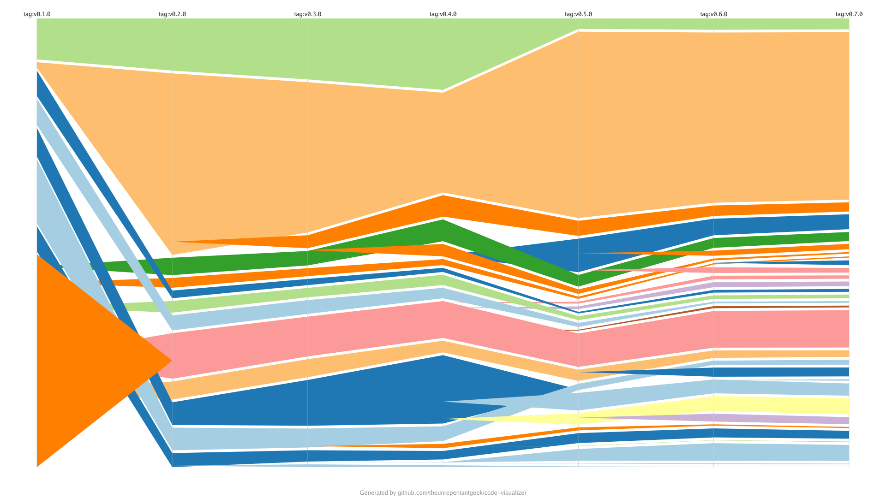

# Alluvial Sample

Demonstrates the **alluvial** visualization across every visualization
milestone in CodeViz, from the initial tree-map through Alluvial itself.



## What it shows

| Visual property | Value |
| --------------- | ----- |
| Columns | Annotated `v0.1.0` through `v0.7.0` visualization milestone tags |
| Flow width | `file-lines` for each directory at each milestone |
| Directory detail | Direct children of `cmd` and `internal` |

The sample compares repository snapshots at the annotated milestone tags. A
directory's width is its line count in that snapshot, so the bands expose
growth, movement, introductions, and removals without treating flow width as a
delta. The explicit `cmd` and `internal` expansions reveal their immediate
subsystems without automatic recursive expansion or an `Other` bucket.

## Try it yourself

```sh
codeviz alluvial . --config samples/alluvial/code-visualizer.yml --output out.png
```

Key knobs in [`code-visualizer.yml`](code-visualizer.yml) to experiment with:

- `alluvial.references` — ordered tags, commit IDs, or dates to compare.
- `alluvial.metric` — numeric directory metric that determines flow width.
- `alluvial.expand` — directories whose direct children are shown.
