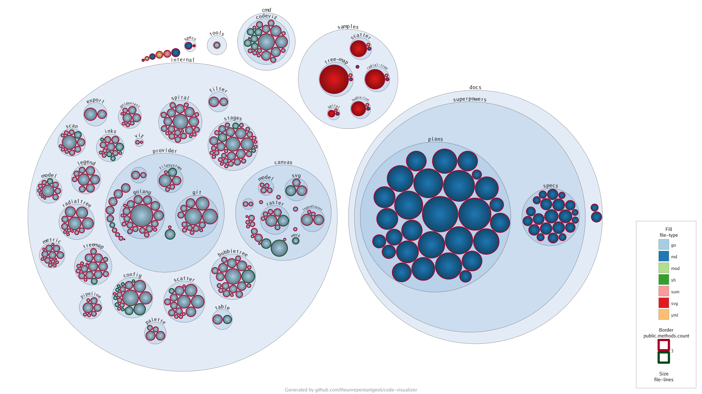

# Bubble-Tree Sample

Demonstrates the **bubble-tree** visualization, which lays out files as circles
packed inside circles, one nesting level per folder.



## What it shows

| Visual property | Metric | Palette |
| --------------- | ------ | ------- |
| Bubble size     | `file-lines` | — |
| Fill colour     | `file-type` | `categorization` |
| Border colour   | `public.methods.count` | `good-bad` |
| Labels          | folders | — |

Bubble area scales with file length, fill colour groups files by type, and the
border draws attention to how many public methods each file exposes.

## Try it yourself

```sh
codeviz bubble-tree . --config samples/bubble-tree/code-visualizer.yml --output out.png
```

Key knobs in [`code-visualizer.yml`](code-visualizer.yml) to experiment with:

- `bubble-tree.size` — the metric that drives bubble area.
- `bubble-tree.fill` / `bubble-tree.border` — swap in other metrics and palettes.
- `bubble-tree.labels` — `none`, `folders`, or `all`.
