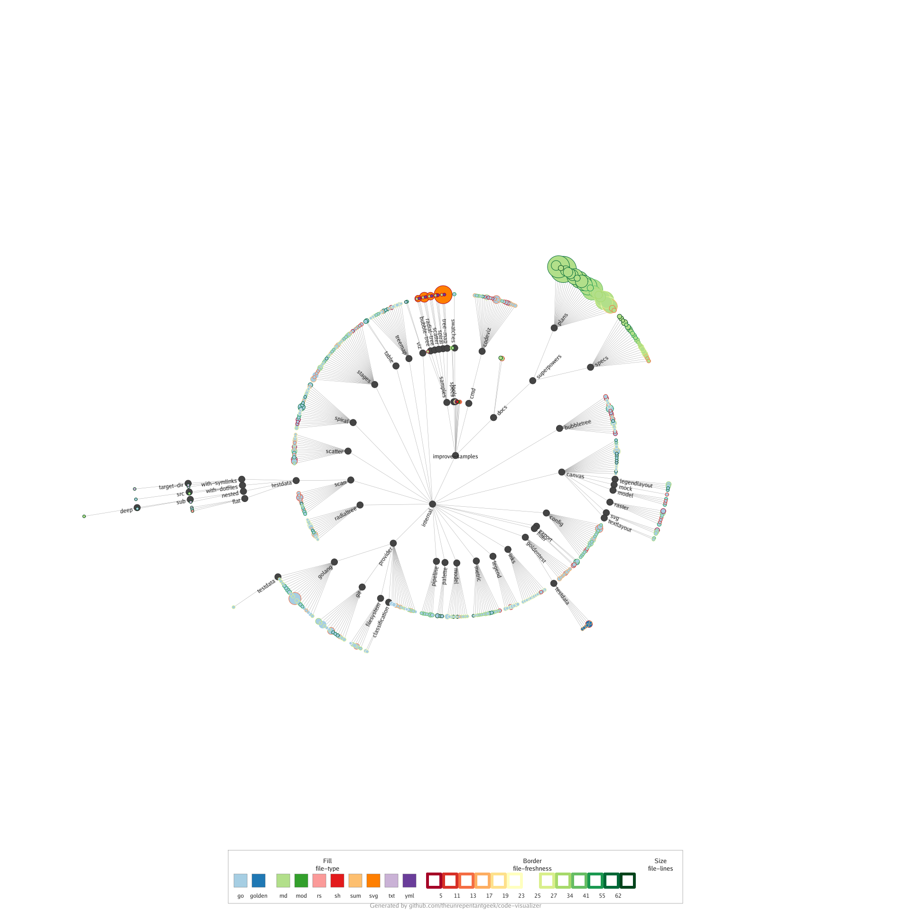

# Radial-Tree Sample

Demonstrates the **radial-tree** visualization, which arranges files as discs
radiating outward from the repository root, one ring per folder depth.



## What it shows

| Visual property | Metric | Palette |
| --------------- | ------ | ------- |
| Disc size       | `file-lines` | — |
| Fill colour     | `file-type` | `categorization` |
| Border colour   | `file-freshness` | `good-bad` |
| Labels          | folders | — |

Disc area scales with file length, fill colour groups files by type, and the
border reflects how recently each file changed.

## Try it yourself

```sh
codeviz radial-tree . --config samples/radial-tree/code-visualizer.yml --output out.png
```

Key knobs in [`code-visualizer.yml`](code-visualizer.yml) to experiment with:

- `radial-tree.discSize` — the metric that drives disc area.
- `radial-tree.fill` / `radial-tree.border` — swap in other metrics and palettes.
- `legend.position` / `legend.orientation` — where the legend is drawn.
