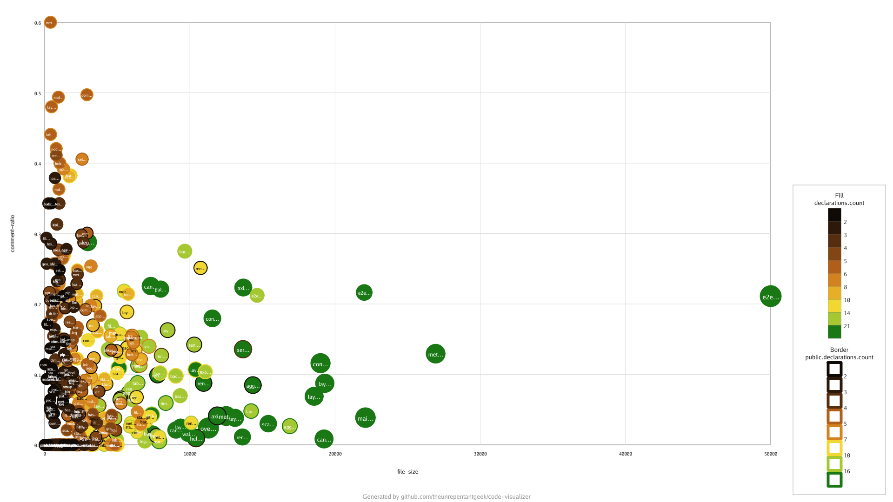

# Scatter Sample

Demonstrates the **scatter** visualization, which plots each file as a point on
a pair of metric axes — ideal for spotting correlations and outliers.



## What it shows

| Visual property | Metric | Palette |
| --------------- | ------ | ------- |
| X axis          | `file-size` | — |
| Y axis          | `comment-ratio` | — |
| Point size      | `declarations.count` | — |
| Fill colour     | `declarations.count` | `foliage` |
| Border colour   | `public.declarations.count` | `foliage` |

Each point is one file: its position compares raw size against comment ratio,
while size and colour surface how many declarations (and public declarations)
the file contains.

## Try it yourself

```sh
codeviz scatter . --config samples/scatter/code-visualizer.yml --output out.png
```

Key knobs in [`code-visualizer.yml`](code-visualizer.yml) to experiment with:

- `scatter.xAxis` / `scatter.yAxis` — the metrics plotted on each axis.
- `scatter.size` — the metric that drives point area.
- `scatter.fill` / `scatter.border` — metrics and palettes for point colour.
