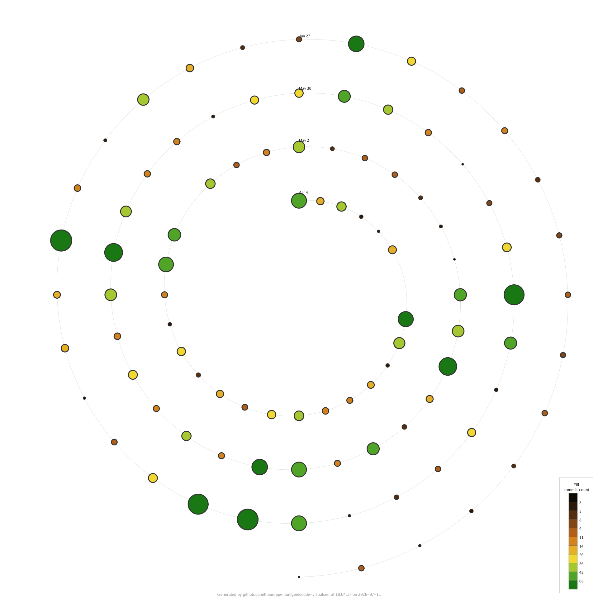

# Spiral Sample

Demonstrates the **spiral** visualization, which plots commit history along a
time spiral — each lap around the spiral is one unit of time.



## What it shows

| Visual property | Metric | Palette |
| --------------- | ------ | ------- |
| Point size      | `commit-count` | — |
| Fill colour     | `commit-count` | `foliage` |
| Labels          | laps | — |

Commits are bucketed at `daily` resolution and laid out on a logarithmic
x-axis, so busy and quiet periods are both readable. Both point size and fill
colour encode how many commits landed in each bucket.

## Try it yourself

```sh
codeviz spiral . --config samples/spiral/code-visualizer.yml --output out.png
```

Key knobs in [`code-visualizer.yml`](code-visualizer.yml) to experiment with:

- `spiral.resolution` — time bucket size (e.g. `daily`, `weekly`).
- `spiral.size` / `spiral.fill` — metrics and palette driving each point.
- `spiral.x-axis` — `linear` or `log` spacing.
- `spiral.labels` — `none` or `laps`.
