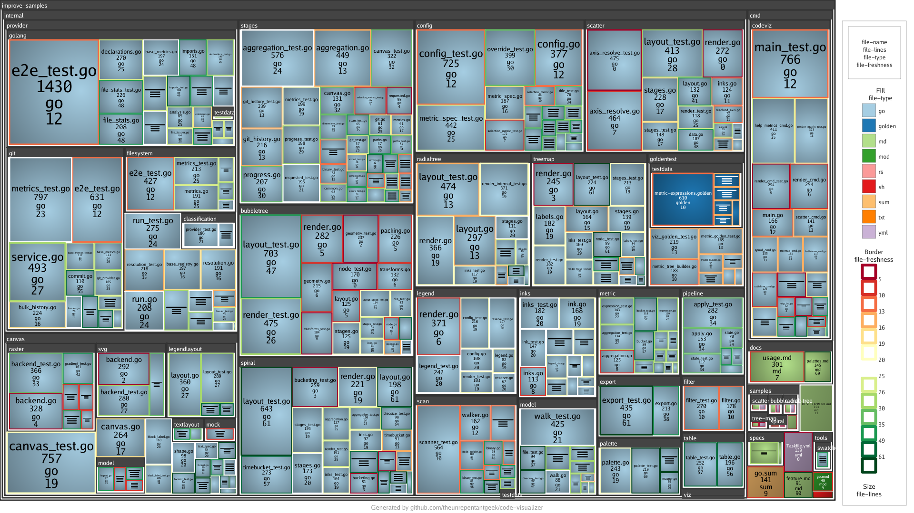

# Tree-Map Sample

Demonstrates the **tree-map** visualization, which packs every file into a
space-filling layout of nested rectangles that mirrors the folder hierarchy.



## What it shows

| Visual property | Metric | Palette |
| --------------- | ------ | ------- |
| Rectangle size  | `file-lines` | — |
| Fill colour     | `file-type` | `categorization` |
| Border colour   | `file-freshness` | `good-bad` |

Larger rectangles are longer files; fill colour groups files by type, while the
border highlights how recently each file changed.

## Try it yourself

```sh
codeviz tree-map . --config samples/tree-map/code-visualizer.yml --output out.png
```

Key knobs in [`code-visualizer.yml`](code-visualizer.yml) to experiment with:

- `tree-map.size` — the metric that drives rectangle area.
- `tree-map.fill` / `tree-map.border` — swap in other metrics and palettes.
- `legend.position` / `legend.orientation` — where the legend is drawn.
